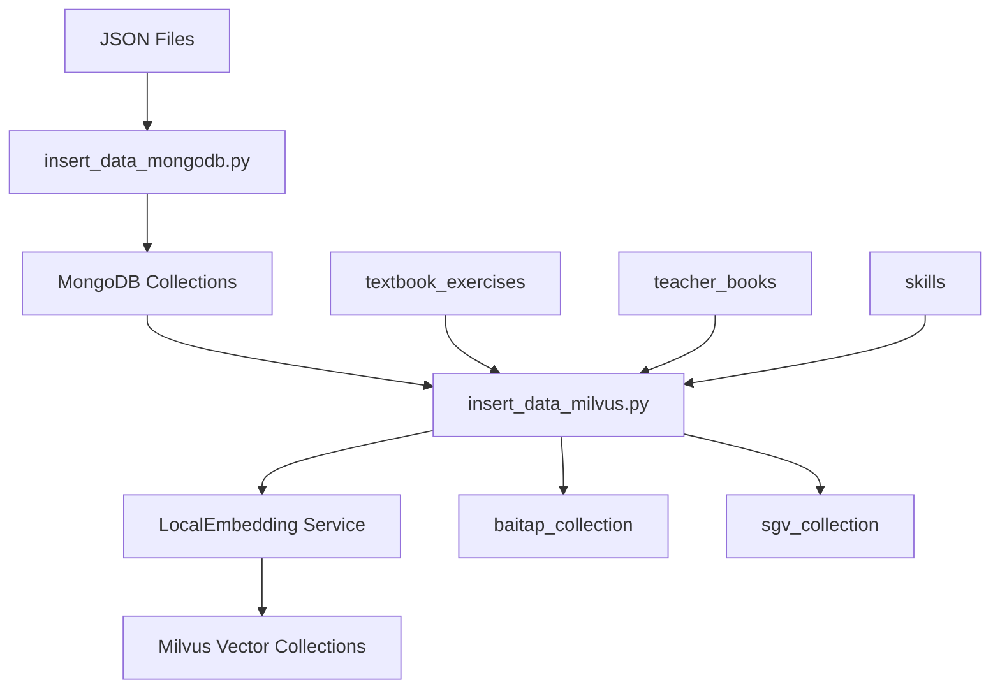

# 🗄️ Database Module

> Comprehensive database management cho hệ thống Mini Adaptive Learning - Quản lý MongoDB, Milvus vector DB, và Vietnamese text embeddings

## 📋 Giới thiệu

Module **database** là lớp dữ liệu của hệ thống, đảm nhận:

- 📚 **MongoDB**: Primary database cho questions, users, skills, textbook_exercises, teacher_books
- 🔍 **Milvus**: Vector database cho semantic search và RAG với 2 collections
- 🤖 **Vietnamese Embeddings**: Text embedding service với sentence-transformers (768-dim)
- ⚙️ **CRUD Clients**: Unified clients với error handling và logging
- 📊 **Unified Data Pipeline**: Single script để import từ MongoDB → Milvus với embeddings

## 🛠️ Tech Stack

```python
# Core
pymongo >= 4.6.0              # MongoDB driver
pymilvus                      # Milvus vector database
sentence-transformers==5.1.1  # Vietnamese embeddings
torch                         # Deep learning backend

# Utils
python-dotenv                 # Environment management
tqdm                          # Progress bars
numpy==1.26.4                # Numerical computing
scikit-learn==1.3.2          # ML utilities
```

## 📦 Cài đặt

```bash
# From project root
pip install -r requirements.txt
```

## 🚀 Quick Start

### 1. Environment Setup

Tạo file `.env` ở project root:

```env
# MongoDB
MONGO_URL=mongodb://localhost:27017
DATABASE_NAME=mini_adaptive_learning

# Milvus
MILVUS_HOST=localhost
MILVUS_PORT=19530

# Data paths
SGK_JSON_1=database/data_insert/sgk-toan-1-ket-noi-tri-thuc-tap-1.json
SGK_JSON_2=database/data_insert/sgk-toan-1-ket-noi-tri-thuc-tap-2.json
SGV_JSON_PATH=database/data_insert/sgv_ketnoitrithuc.json
```

### 2. Start Databases

```bash
# Via Docker Compose (recommended)
docker-compose up -d

# Or manual start
# MongoDB: mongod --dbpath /data/db
# Milvus: Follow Milvus installation guide
```

### 3. Setup Collections & Indexes

```bash
# MongoDB - Tạo collections và indexes
cd database/mongodb
python setup_mongodb.py

# Milvus - Tạo vector collections
cd ../milvus
python setup_milvus.py
```

### 4. Import Data

```bash
# Step 1: Import raw data vào MongoDB
cd database/mongodb
python insert_data_mongodb.py          # Import tất cả data từ JSON files

# Step 2: Generate embeddings và insert vào Milvus
cd ../milvus
python insert_data_milvus.py           # Load từ MongoDB → Generate embeddings → Insert Milvus
```

**✨ New Unified Pipeline:**
- ✅ Single script `insert_data_milvus.py` thay thế 2 scripts cũ
- ✅ Tự động lấy data từ MongoDB (textbook_exercises, teacher_books)
- ✅ Resolve skill_name từ skill_id (ObjectId reference)
- ✅ Chỉ embed 2 part đầu tiên cho SGV (giống insert_sgv_to_milvus.py cũ)
- ✅ Clear data trước khi insert để tránh duplicates
- ✅ Progress bars cho tất cả operations

## 📁 Cấu trúc Module

```
database/
├── data_insert/                 # 📂 Raw JSON data files
│   ├── grades.json
│   ├── skills.json
│   ├── subjects.json
│   ├── users.json
│   ├── placement_questions.json
│   ├── sgk-toan-1-ket-noi-tri-thuc-tap-1.json
│   ├── sgk-toan-1-ket-noi-tri-thuc-tap-2.json
│   └── sgv_ketnoitrithuc.json
│
├── embeddings/                  # 🤖 Vietnamese embedding service
│   ├── local_embedder.py       # Main embedding class (768-dim)
│   └── __pycache__/
│
├── milvus/                      # 🔍 Vector database
│   ├── milvus_client.py        # CRUD client
│   ├── setup_milvus.py         # Create collections (drop if exists)
│   ├── insert_data_milvus.py   # 🆕 Unified: MongoDB → Embeddings → Milvus
│   ├── insert_sgv_to_milvus.py # ⚠️ Legacy (use insert_data_milvus.py)
│   └── insert_sgk_to_milvus.py # ⚠️ Legacy (use insert_data_milvus.py)
│
├── mongodb/                     # 📚 Primary database
│   ├── mongodb_client.py       # CRUD client
│   ├── setup_mongodb.py        # Create collections & indexes (drop if exists)
│   ├── insert_data_mongodb.py  # 🆕 Unified: Import all JSON → MongoDB
│   └── __pycache__/
│
└── README.md                    # 📖 This file
```

## Core Components

### 1. MongoDB Management (`mongodb/`)

#### `mongodb_client.py`
Unified CRUD client for MongoDB operations with automatic error handling and logging.

```python
from database.mongodb.mongodb_client import connect, insert, find, update, delete

# Connect to database
db = connect()

# Insert data
result = insert("collection_name", {"field": "value"})

# Find documents
docs = find("collection_name", {"field": "value"})

# Update documents
updated_count = update("collection_name", {"_id": "123"}, {"$set": {"field": "new_value"}})

# Delete documents
deleted_count = delete("collection_name", {"field": "value"})
```

**Key Features:**
- Automatic connection management
- Built-in error handling and logging
- Support for bulk operations
- Automatic timestamping (created_at, updated_at)
- Index management utilities

#### `setup_mongodb.py`
Creates database collections and indexes for optimal query performance.

```python
# Usage
python setup_mongodb.py
```

**Collections Created:**
- `subjects` - Academic subjects (with unique indexes)
- `grades` - Grade levels (with unique indexes)
- `skills` - Learning skills and competencies (with composite unique index)
- `users` - User accounts with authentication
- `placement_questions` - Quiz questions for assessment
- `teacher_books` - SGV materials (Sách Giáo Viên) from JSON
- `textbook_exercises` - SGK exercises (Sách Giáo Khoa) from JSON
- `profile_student` - Student profiles from SAINT analysis

**🔄 Drop & Recreate:**
- Tự động drop collections cũ trước khi tạo mới
- Đảm bảo clean setup mỗi lần chạy

#### `insert_data_mongodb.py` 🆕
**Unified script** để import tất cả data từ JSON files vào MongoDB.

```python
# Usage
python insert_data_mongodb.py

# Features:
# - Import tất cả collections: subjects, grades, skills, users, placement_questions, textbook_exercises, teacher_books
# - SHA-256 password hashing cho users
# - Skill name resolution với grade/subject
# - Progress bars cho tất cả operations
# - Clean logging output
```

**Collections Imported:**
1. **subjects** - từ `subjects.json`
2. **grades** - từ `grades.json`
3. **skills** - từ `skills.json` (với grade_id & subject_id)
4. **users** - từ `users.json` (với password hashing)
5. **placement_questions** - từ `placement_questions.json`
6. **textbook_exercises** - từ SGK JSON files (với skill_id resolution)
7. **teacher_books** - từ SGV JSON file (với skill_id resolution)

**Output Example:**
```
Inserting Subjects...
✓ Inserted 1 subjects
Inserting Grades...
✓ Inserted 12 grades
Inserting Skills...
✓ Inserted 40 skills
...
```

### 2. Milvus Vector Database (`milvus/`)

#### `milvus_client.py`
Unified CRUD client for Milvus operations with automatic error handling and logging.

```python
from database.milvus.milvus_client import connect, insert, search, query, create_collection

# Connect to Milvus
client = connect()

# Create collection
create_collection("my_collection", fields, description="My collection")

# Insert vectors
result = insert("my_collection", data)

# Search similar vectors
results = search("my_collection", query_vectors, limit=10)

# Query with metadata filtering
results = query("my_collection", expr="field == 'value'")
```

**Key Features:**
- Automatic connection management
- Built-in error handling and logging
- Support for vector similarity search
- Metadata filtering capabilities
- Collection management utilities

#### `setup_milvus.py`
Creates vector database collections với proper schemas và indexes.

```python
# Usage
python setup_milvus.py

# Collections created:
# - baitap_collection: Textbook exercise embeddings (768D)
# - sgv_collection: Teacher guide embeddings (768D)
```

**🔄 Drop & Recreate:**
- Tự động drop collections cũ nếu tồn tại
- Đảm bảo clean schema mỗi lần setup

**Schema:**

**baitap_collection:**
- `id` (VARCHAR, primary): vector_id từ MongoDB
- `question_content` (VARCHAR): Nội dung câu hỏi
- `lesson` (VARCHAR): Tên bài học
- `skill_name` (VARCHAR): Tên kỹ năng (resolved từ skill_id)
- `source` (VARCHAR): Nguồn (SGK)
- `embedding` (FLOAT_VECTOR, 768): Vector embedding

**sgv_collection:**
- `id` (VARCHAR, primary): vector_id từ MongoDB
- `lesson` (VARCHAR): Tên bài học
- `skill_name` (VARCHAR): Tên kỹ năng (resolved từ skill_id)
- `content` (VARCHAR): Toàn bộ nội dung từ parts
- `source` (VARCHAR): Nguồn (SGV)
- `embedding` (FLOAT_VECTOR, 768): Vector embedding (chỉ từ 2 part đầu)

#### `insert_data_milvus.py` 🆕
**Unified script** để load data từ MongoDB, generate embeddings, và insert vào Milvus.

```python
# Usage
python insert_data_milvus.py

# Features:
# - Load từ MongoDB (textbook_exercises, teacher_books, skills)
# - Resolve skill_name từ skill_id (ObjectId reference)
# - Generate embeddings: dangvantuan/vietnamese-document-embedding (768D)
# - SGV: Chỉ embed 2 part đầu tiên (như insert_sgv_to_milvus.py cũ)
# - Baitap: Embed question_content + lesson + source
# - Clear collections trước khi insert
# - Progress bars cho tất cả operations
```

**Embedding Strategy:**

**Baitap (Textbook Exercises):**
```python
text_for_embedding = f"{question_content} | {lesson} | {source}"
```

**SGV (Teacher Books):**
```python
# Chỉ lấy 2 part đầu tiên
text_for_embedding = f"{topic_0} | {content_0} | {topic_1} | {content_1}"
# Lưu toàn bộ content từ tất cả parts vào field "content"
```

**Output Example:**
```
============================================================
📚 INSERTING BAITAP DATA (from MongoDB)
============================================================
🔗 Connecting to Milvus...
✅ Collection 'baitap_collection' exists
🗑️  Clearing existing data from 'baitap_collection'...
📖 Loading data from MongoDB (textbook_exercises collection)...
✅ Loaded 432 exercises from MongoDB
🧠 Generating embeddings...
Building texts: 100%|██████████| 432/432
Batches: 100%|██████████| 27/27
💾 Inserting data into Milvus...
✅ Inserted 432 vectors into 'baitap_collection'

============================================================
📖 INSERTING SGV DATA (from MongoDB)
============================================================
...
```

### 3. Embedding Service (`embeddings/`)

#### `local_embedder.py`
High-performance Vietnamese text embedding service với 768-dim vectors.

```python
from database.embeddings.local_embedder import LocalEmbedding

# Initialize embedder
embedder = LocalEmbedding(
    model_name='dangvantuan/vietnamese-document-embedding',
    batch_size=5,  # Optimized for memory usage
    verbose=True
)

# Embed single text
embedding = embedder.embed_single_text("Xin chào, tôi là trí tuệ nhân tạo.")
# Returns: List[float] with 768 dimensions

# Embed multiple texts with progress bar
texts = ["Text 1", "Text 2", "Text 3"]
embeddings = embedder.embed_texts(texts)
# Returns: List[List[float]] - each inner list is 768D
```

**Key Features:**
- ✅ **Model**: dangvantuan/vietnamese-document-embedding (optimized for Vietnamese)
- ✅ **Dimension**: 768 (compatible with Milvus collections)
- ✅ **GPU/CPU Detection**: Automatic device selection
- ✅ **Memory Optimized**: batch_size=5 (reduced from 16)
- ✅ **Batch Processing**: Efficient processing với progress bars
- ✅ **Clean Output**: Minimal logging, only progress bars

**Configuration:**
```python
# Default settings in local_embedder.py
EMBEDDING_DIMENSION = 768
DEFAULT_BATCH_SIZE = 5  # Optimized cho lighter memory footprint
DEFAULT_MODEL = "dangvantuan/vietnamese-document-embedding"
```

**Usage in Pipeline:**
```python
# In insert_data_milvus.py
embedder = LocalEmbedding(verbose=True)
texts = ["text1", "text2", ...]
embeddings = embedder.embed_texts(texts)
# Progress: Batches: 100%|██████████| 27/27 [00:15<00:00]
```
- `show_progress` (bool): Enable `tqdm` progress bars (default: True)

**Returns:**
- `List[List[float]]`: 768-dimensional embedding vectors
- `None`: For empty or invalid input

## Data Schemas

### MongoDB Collections

#### `placement_questions`
```javascript
{
  "_id": ObjectId,
  "question_id": "Q00001",
  "grade": 1,
  "skill": "S1",
  "skill_name": "Các số 0, 1, 2, 3, 4, 5",
  "subject": "Toán",
  "question": "Số nào đứng trước số 3?",
  "answers": [
    {"text": "2", "correct": true},
    {"text": "1", "correct": false}
  ],
  "image_question": "",
  "image_answer": "",
  "difficulty": "easy",
  "created_at": ISODate,
  "updated_at": ISODate
}
```

#### `users`
```javascript
{
  "_id": ObjectId,
  "email": "student1@gmail.com",
  "username": "student1",
  "role": "student",
  "full_name": "Phan Thiên Ân",
  "password_hash": "salt:hash",
  "created_at": ISODate,
  "updated_at": ISODate,
  "status": "active"
}
```

### Milvus Collections

#### `sgv_collection`
```python
{
  "id": INT64,           # Primary key (auto-generated)
  "lesson": VARCHAR,     # Lesson title (max 2048 chars)
  "content": VARCHAR,    # Full content (max 65535 chars)
  "source": VARCHAR,     # Source information (max 2048 chars)
  "embedding": FLOAT_VECTOR  # 768-dimensional vector
}
```

## Usage Examples

### Querying Questions by Skill

```python
from pymongo import MongoClient

client = MongoClient("mongodb://localhost:27017")
db = client["mini_adaptive_learning"]

# Find questions for specific skill
questions = db.placement_questions.find({
    "skill": "S1",
    "grade": 1,
    "subject": "Toán"
})

# Generate random quiz
pipeline = [
    {"$match": {"grade": 1, "subject": "Toán"}},
    {"$sample": {"size": 30}}
]
quiz_questions = list(db.placement_questions.aggregate(pipeline))
```

### Vector Similarity Search

```python
from pymilvus import Collection

# Load collection
collection = Collection("sgv_collection")
collection.load()

# Search for similar content
results = collection.search(
    data=[query_embedding],
    anns_field="embedding",
    param={"metric_type": "L2", "params": {"nprobe": 10}},
    limit=5,
    output_fields=["lesson", "content", "source"]
)
```

### Custom Embedding Generation

```python
from database.embeddings.local_embedder import LocalEmbedding

# Initialize with custom settings
embedder = LocalEmbedding(
    model_name='dangvantuan/vietnamese-document-embedding',
    batch_size=32,
    verbose=False
)

# Process educational content
content = "Bài học về phép cộng trong phạm vi 10"
embedding = embedder.embed_single_text(content)

# Batch processing for multiple documents
documents = [
    "Nội dung bài học 1",
    "Nội dung bài học 2",
    "Nội dung bài học 3"
]
embeddings = embedder.embed_texts(documents)
```

## Error Handling

### Common Issues

**MongoDB Connection Errors:**
```python
# Check MongoDB service status
from pymongo import MongoClient
try:
    client = MongoClient("mongodb://localhost:27017")
    client.admin.command('ping')
    print("MongoDB connection successful")
except Exception as e:
    print(f"MongoDB connection failed: {e}")
```

**Milvus Collection Errors:**
```python
from pymilvus import utility

# Check if collection exists
if utility.has_collection("sgv_collection"):
    print("Collection exists")
else:
    print("Collection not found - run setup_milvus.py")
```

**Embedding Generation Errors:**
```python
try:
    embedding = embedder.embed_single_text(text)
except ValueError as e:
    print(f"Embedding failed: {e}")
    # Handle empty or invalid text
```

## Performance Optimization

### MongoDB
- Use compound indexes for frequent query patterns
- Implement connection pooling for high-traffic applications
- Use projection to limit returned fields
- Leverage `mongodb_client.py` for optimized CRUD operations

### Milvus
- Load collections before querying
- Use appropriate index types (IVF_FLAT, IVF_SQ8)
- Batch insert operations for better throughput
- Leverage `milvus_client.py` for optimized vector operations

### Embedding Service
- Use GPU when available for faster processing
- Adjust batch size based on available memory
- Use parallel processing for large datasets
- Enable progress tracking for better user experience

### Progress Tracking
- All import scripts now feature `tqdm` progress bars
- Minimal logging output for cleaner console experience
- Real-time processing status and ETA estimates
- Batch operation progress tracking

## Data Migration

### Backup and Restore

```bash
# MongoDB backup
mongodump --db mini_adaptive_learning --out backup/

# MongoDB restore
mongorestore --db mini_adaptive_learning backup/mini_adaptive_learning/

# Milvus backup (requires Milvus backup tools)
# Refer to Milvus documentation for backup procedures
```

### Environment Migration

```bash
# Update connection strings in .env
MONGO_URL=mongodb://new-host:27017
MILVUS_HOST=new-milvus-host
MILVUS_PORT=19530
```

## 🐛 Troubleshooting

### 1. MongoDB Connection Failed

**Error**: `pymongo.errors.ServerSelectionTimeoutError`

```bash
# Check if MongoDB is running
docker ps | grep mongo
# Or
mongosh --eval "db.runCommand({ ping: 1 })"

# Restart MongoDB
docker-compose restart mongodb

# Check connection string
python -c "
from database.mongodb.mongodb_client import connect
db = connect()
print('✓ Connected:', db.name)
"
```

### 2. Milvus Connection Failed

**Error**: `MilvusException: failed to connect to server`

```bash
# Check Milvus status
docker ps | grep milvus

# Restart Milvus
docker-compose restart milvus-standalone

# Test connection
python -c "
from pymilvus import connections
connections.connect('default', host='localhost', port='19530')
print('✓ Connected to Milvus')
"
```

### 3. Empty Collections

**Issue**: Collections exist but have no data

```bash
# Check MongoDB
python -c "
from database.mongodb.mongodb_client import connect
db = connect()
print('placement_questions:', db.placement_questions.count_documents({}))
print('users:', db.users.count_documents({}))
print('textbook_exercises:', db.textbook_exercises.count_documents({}))
"

# Check Milvus
python -c "
from pymilvus import Collection
sgv = Collection('sgv_collection')
print('SGV vectors:', sgv.num_entities)
baitap = Collection('baitap_collection')
print('Baitap vectors:', baitap.num_entities)
"

# Re-import if needed
cd database/mongodb
python insert_placement_questions.py
```

### 4. Embedding Generation Slow/Failed

**Issue**: Embedding takes too long or OOM

```python
# Reduce batch size in local_embedder.py
embedder = LocalEmbedding(
    batch_size=8,  # Default: 16, reduce if OOM
    verbose=True
)

# Use CPU if GPU issues
import torch
torch.cuda.is_available()  # Should return False to force CPU
```

**Issue**: `CUDA out of memory`

```bash
# Clear GPU cache
python -c "
import torch
torch.cuda.empty_cache()
print('✓ GPU cache cleared')
"

# Or force CPU mode
export CUDA_VISIBLE_DEVICES=-1
```

### 5. Progress Bar Not Showing

**Issue**: No progress bars during import

```bash
# Install tqdm
pip install tqdm

# Check terminal encoding (Windows)
chcp 65001  # Set UTF-8 encoding

# Use PowerShell (better Unicode support)
# Not CMD
```

### 6. Duplicate Data Issues

**Issue**: Running import scripts multiple times creates duplicates

```bash
# Scripts use UPSERT logic - safe to re-run
# But if you want to clean:

# MongoDB - Drop collection
python -c "
from database.mongodb.mongodb_client import connect
db = connect()
db.placement_questions.drop()
print('✓ Dropped placement_questions')
"

# Milvus - Drop collection
python -c "
from pymilvus import utility
utility.drop_collection('sgv_collection')
print('✓ Dropped sgv_collection')
"

# Then re-setup and re-import
python setup_mongodb.py
python insert_placement_questions.py
```

### 7. Import Script Hangs

**Issue**: Script hangs without error

```bash
# Check file paths in .env
cat .env | grep JSON

# Verify JSON files exist
ls -la database/data_insert/*.json

# Check file permissions
# Windows: Right-click > Properties > Security

# Test JSON validity
python -c "
import json
with open('database/data_insert/grade1_math_questions_complete.json') as f:
    data = json.load(f)
    print(f'✓ Valid JSON: {len(data)} items')
"
```

### 8. Vector Search Returns Nothing

**Issue**: Milvus search returns empty results

```python
from pymilvus import Collection

# Load collection first (important!)
collection = Collection('sgv_collection')
collection.load()

# Check if collection has data
print(f"Entities: {collection.num_entities}")

# Verify embedding dimension matches (768)
print(f"Schema: {collection.schema}")
```

### 9. Slow Vector Search

**Issue**: Milvus search takes too long

```python
# Create index if not exists
from pymilvus import Collection

collection = Collection('sgv_collection')

# Check current index
print(collection.index().params)

# Create IVF_FLAT index
index_params = {
    "metric_type": "L2",
    "index_type": "IVF_FLAT",
    "params": {"nlist": 128}
}
collection.create_index("embedding", index_params)
collection.load()
```

### 10. Docker Issues

**Issue**: Containers won't start

```bash
# Check Docker is running
docker info

# Check disk space
df -h

# View logs
docker-compose logs milvus-standalone
docker-compose logs mongodb

# Restart all
docker-compose down
docker-compose up -d

# Check ports not in use
netstat -an | findstr :19530  # Milvus
netstat -an | findstr :27017  # MongoDB
```

---

## � Data Pipeline Flow (Current Architecture)

### Complete Setup Flow



### Detailed Steps

**1. Setup Phase:**
```bash
# Drop & recreate MongoDB collections
python database/mongodb/setup_mongodb.py

# Drop & recreate Milvus collections  
python database/milvus/setup_milvus.py
```

**2. Import Raw Data to MongoDB:**
```bash
python database/mongodb/insert_data_mongodb.py
```
- Loads từ JSON files trong `data_insert/`
- Inserts vào MongoDB collections
- Creates indexes
- Hashes passwords cho users

**3. Generate Embeddings & Insert to Milvus:**
```bash
python database/milvus/insert_data_milvus.py
```
- Loads data từ MongoDB (`textbook_exercises`, `teacher_books`)
- Resolves `skill_name` từ `skill_id` (ObjectId reference to `skills` collection)
- Generates 768D embeddings cho Vietnamese text
- Clears existing Milvus data
- Inserts vectors với metadata

### Key Changes from Legacy

| Legacy | Current (Unified) |
|--------|-------------------|
| 2 scripts: `insert_sgk_to_milvus.py` + `insert_sgv_to_milvus.py` | 1 script: `insert_data_milvus.py` |
| Load từ JSON files | Load từ MongoDB |
| Manual skill mapping | Automatic skill_id → skill_name resolution |
| No clear before insert | Auto clear trước insert |
| Inconsistent text building | Consistent: SGV uses 2 parts đầu tiên |

### Skill Resolution Logic

```python
# In insert_data_milvus.py
def get_skill_name_from_id(skill_id: str) -> str:
    """
    skill_id in textbook_exercises/teacher_books is ObjectId string
    referencing _id in skills collection
    """
    skills_collection = get_mongodb_collection("skills")
    object_id = ObjectId(skill_id)
    skill_doc = skills_collection.find_one({"_id": object_id})
    return skill_doc.get("skill_name", "")
```

### Text Embedding Strategy

**Baitap (Textbook Exercises):**
```python
# Combine all fields with separator
text = f"{question_content} | {lesson} | {source}"
embedding = embedder.embed_single_text(text)  # 768D
```

**SGV (Teacher Books):**
```python
# Only first 2 parts for embedding (same as legacy insert_sgv_to_milvus.py)
parts = teacher_book.get("parts", [])[:2]
text = " | ".join([part["topic"], part["content"]] for part in parts)
embedding = embedder.embed_single_text(text)  # 768D

# But save full content to Milvus
full_content = "\n".join(all_parts_content)
```

---

## �📚 Tài liệu tham khảo

- [MongoDB Python Driver Docs](https://pymongo.readthedocs.io/)
- [Milvus Python SDK Docs](https://milvus.io/docs)
- [Sentence Transformers Docs](https://www.sbert.net/)
- [Vietnamese Embedding Model](https://huggingface.co/dangvantuan/vietnamese-document-embedding)
- [BSON ObjectId](https://pymongo.readthedocs.io/en/stable/api/bson/objectid.html)

---

**Maintainer**: Mini Adaptive Learning Team  
**Last Updated**: October 21, 2025